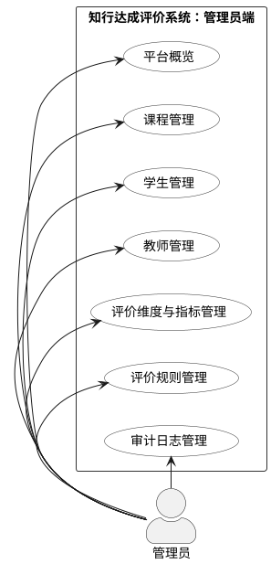

# 管理员端系统用例图

## 用例说明

管理员端主要面向平台基础数据和评价规则维护，不直接承担学生学习过程操作。结合当前项目路由和接口，管理员端包含以下用例：

| 模块 | 主要用例 | 说明 |
|---|---|---|
| 平台概览 | 查看平台概览 | 查看系统整体数据概况。 |
| 课程管理 | 查询、新增、编辑、启用/停用、删除课程，配置授课教师 | 对课程基础信息和教师课程关系进行维护。 |
| 学生管理 | 查询、新增、批量导入、编辑、启用/停用、删除学生账号 | 维护学生账号和基础信息。 |
| 教师管理 | 查询、新增、批量导入、编辑、启用/停用、删除教师账号 | 维护教师账号和基础信息。 |
| 评价维度与指标管理 | 配置评价维度、评价指标、指标权重 | 管理系统评价模型中的维度、指标和权重配置。 |
| 评价规则管理 | 配置学习者画像规则、评价阈值、阶段评价规则 | 维护学生画像分类与评价判定规则。 |
| 审计日志管理 | 查询日志、筛选日志 | 查看管理员关键操作记录，支撑系统追踪与审计。 |
