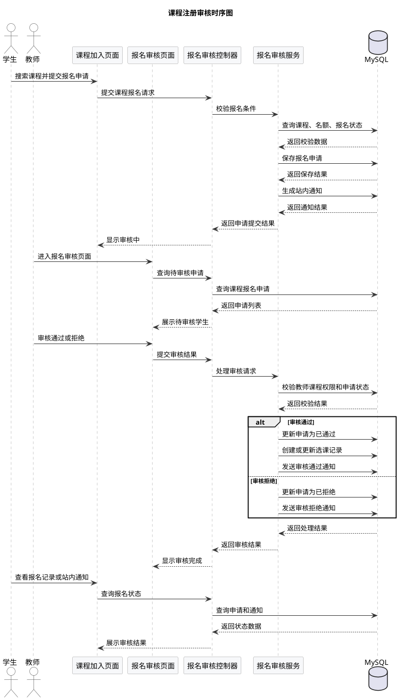

# 课程注册审核时序图

```plantuml
@startuml
title 课程注册审核时序图

skinparam shadowing false
skinparam sequence {
  ArrowColor #333333
  LifeLineBorderColor #999999
  ParticipantBorderColor #999999
  ParticipantBackgroundColor #F7F8FA
  ActorBorderColor #333333
  ActorBackgroundColor #FFFFFF
}

actor "学生" as Student
actor "教师" as Teacher
participant "课程加入页面" as StudentPage
participant "报名审核页面" as TeacherPage
participant "报名审核控制器" as Controller
participant "报名审核服务" as Service
database "MySQL" as DB

Student -> StudentPage : 搜索课程并提交报名申请
StudentPage -> Controller : 提交课程报名请求
Controller -> Service : 校验报名条件
Service -> DB : 查询课程、名额、报名状态
DB --> Service : 返回校验数据
Service -> DB : 保存报名申请
DB --> Service : 返回保存结果
Service -> DB : 生成站内通知
DB --> Service : 返回通知结果
Service --> Controller : 返回申请提交结果
Controller --> StudentPage : 显示审核中

Teacher -> TeacherPage : 进入报名审核页面
TeacherPage -> Controller : 查询待审核申请
Controller -> DB : 查询课程报名申请
DB --> Controller : 返回申请列表
Controller --> TeacherPage : 展示待审核学生

Teacher -> TeacherPage : 审核通过或拒绝
TeacherPage -> Controller : 提交审核结果
Controller -> Service : 处理审核请求
Service -> DB : 校验教师课程权限和申请状态
DB --> Service : 返回校验结果

alt 审核通过
  Service -> DB : 更新申请为已通过
  Service -> DB : 创建或更新选课记录
  Service -> DB : 发送审核通过通知
else 审核拒绝
  Service -> DB : 更新申请为已拒绝
  Service -> DB : 发送审核拒绝通知
end

DB --> Service : 返回处理结果
Service --> Controller : 返回审核结果
Controller --> TeacherPage : 显示审核完成

Student -> StudentPage : 查看报名记录或站内通知
StudentPage -> Controller : 查询报名状态
Controller -> DB : 查询申请和通知
DB --> Controller : 返回状态数据
Controller --> StudentPage : 展示审核结果

@enduml
```

