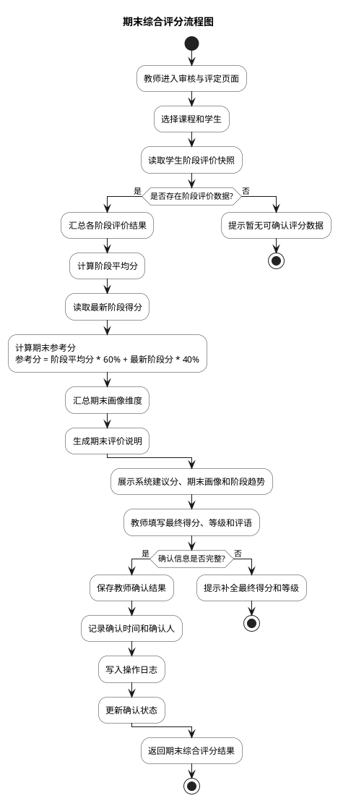

# 期末综合评分流程图

```plantuml
@startuml
title 期末综合评分流程图

skinparam shadowing false
skinparam activity {
  BorderColor #333333
  BackgroundColor #FFFFFF
  DiamondBorderColor #333333
  DiamondBackgroundColor #FFFFFF
}

start

:教师进入审核与评定页面;
:选择课程和学生;
:读取学生阶段评价快照;

if (是否存在阶段评价数据?) then (是)
  :汇总各阶段评价结果;
  :计算阶段平均分;
  :读取最新阶段得分;
  :计算期末参考分\n参考分 = 阶段平均分 * 60% + 最新阶段分 * 40%;
  :汇总期末画像维度;
  :生成期末评价说明;
else (否)
  :提示暂无可确认评分数据;
  stop
endif

:展示系统建议分、期末画像和阶段趋势;
:教师填写最终得分、等级和评语;

if (确认信息是否完整?) then (是)
  :保存教师确认结果;
  :记录确认时间和确认人;
  :写入操作日志;
  :更新确认状态;
else (否)
  :提示补全最终得分和等级;
  stop
endif

:返回期末综合评分结果;

stop

@enduml
```

