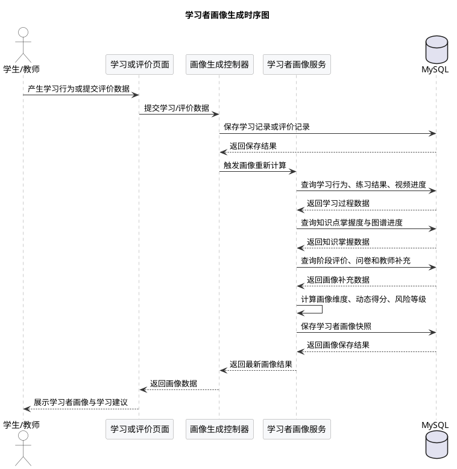

# 学习者画像生成时序图

```plantuml
@startuml
title 学习者画像生成时序图

skinparam shadowing false
skinparam sequence {
  ArrowColor #333333
  LifeLineBorderColor #999999
  ParticipantBorderColor #999999
  ParticipantBackgroundColor #F7F8FA
  ActorBorderColor #333333
  ActorBackgroundColor #FFFFFF
}

actor "学生/教师" as User
participant "学习或评价页面" as Page
participant "画像生成控制器" as Controller
participant "学习者画像服务" as ProfileService
database "MySQL" as DB

User -> Page : 产生学习行为或提交评价数据
Page -> Controller : 提交学习/评价数据
Controller -> DB : 保存学习记录或评价记录
DB --> Controller : 返回保存结果

Controller -> ProfileService : 触发画像重新计算
ProfileService -> DB : 查询学习行为、练习结果、视频进度
DB --> ProfileService : 返回学习过程数据

ProfileService -> DB : 查询知识点掌握度与图谱进度
DB --> ProfileService : 返回知识掌握数据

ProfileService -> DB : 查询阶段评价、问卷和教师补充
DB --> ProfileService : 返回画像补充数据

ProfileService -> ProfileService : 计算画像维度、动态得分、风险等级
ProfileService -> DB : 保存学习者画像快照
DB --> ProfileService : 返回画像保存结果

ProfileService --> Controller : 返回最新画像结果
Controller --> Page : 返回画像数据
Page --> User : 展示学习者画像与学习建议

@enduml
```

