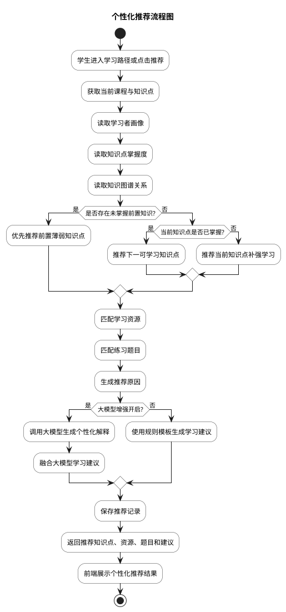

# 个性化推荐流程图

```plantuml
@startuml
title 个性化推荐流程图

skinparam shadowing false
skinparam activity {
  BorderColor #333333
  BackgroundColor #FFFFFF
  DiamondBorderColor #333333
  DiamondBackgroundColor #FFFFFF
}

start

:学生进入学习路径或点击推荐;
:获取当前课程与知识点;
:读取学习者画像;
:读取知识点掌握度;
:读取知识图谱关系;

if (是否存在未掌握前置知识?) then (是)
  :优先推荐前置薄弱知识点;
else (否)
  if (当前知识点是否已掌握?) then (是)
    :推荐下一可学习知识点;
  else (否)
    :推荐当前知识点补强学习;
  endif
endif

:匹配学习资源;
:匹配练习题目;
:生成推荐原因;

if (大模型增强开启?) then (是)
  :调用大模型生成个性化解释;
  :融合大模型学习建议;
else (否)
  :使用规则模板生成学习建议;
endif

:保存推荐记录;
:返回推荐知识点、资源、题目和建议;
:前端展示个性化推荐结果;

stop

@enduml
```

