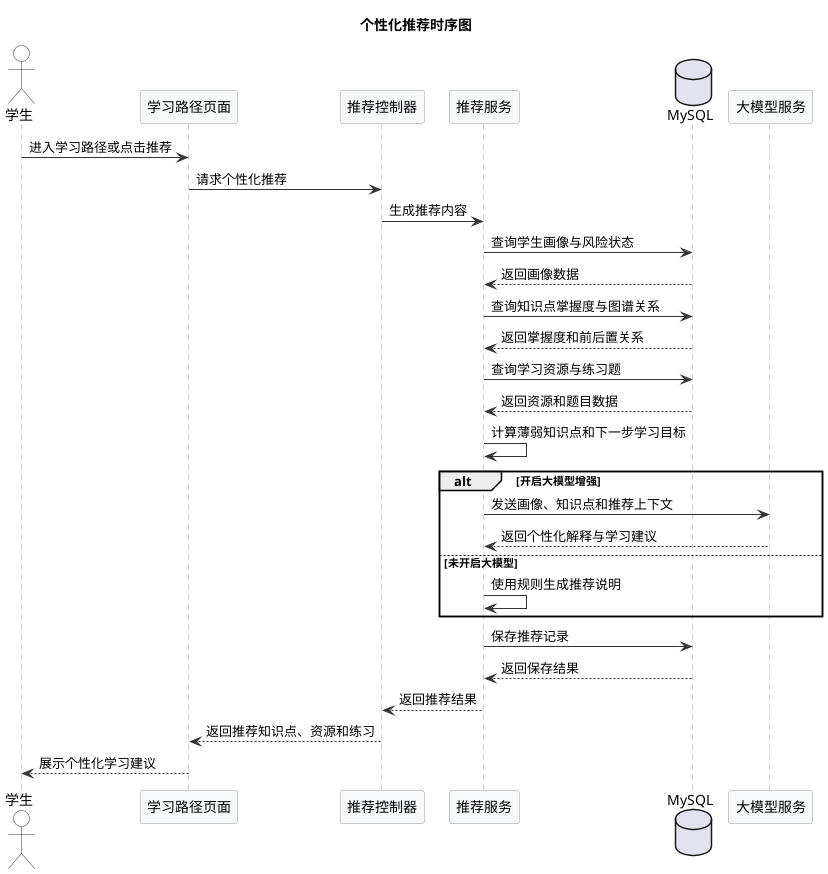

# 个性化推荐时序图

```plantuml
@startuml
title 个性化推荐时序图

skinparam shadowing false
skinparam sequence {
  ArrowColor #333333
  LifeLineBorderColor #999999
  ParticipantBorderColor #999999
  ParticipantBackgroundColor #F7F8FA
  ActorBorderColor #333333
  ActorBackgroundColor #FFFFFF
}

actor "学生" as Student
participant "学习路径页面" as Page
participant "推荐控制器" as Controller
participant "推荐服务" as RecoService
database "MySQL" as DB
participant "大模型服务" as LLM

Student -> Page : 进入学习路径或点击推荐
Page -> Controller : 请求个性化推荐
Controller -> RecoService : 生成推荐内容

RecoService -> DB : 查询学生画像与风险状态
DB --> RecoService : 返回画像数据

RecoService -> DB : 查询知识点掌握度与图谱关系
DB --> RecoService : 返回掌握度和前后置关系

RecoService -> DB : 查询学习资源与练习题
DB --> RecoService : 返回资源和题目数据

RecoService -> RecoService : 计算薄弱知识点和下一步学习目标

alt 开启大模型增强
  RecoService -> LLM : 发送画像、知识点和推荐上下文
  LLM --> RecoService : 返回个性化解释与学习建议
else 未开启大模型
  RecoService -> RecoService : 使用规则生成推荐说明
end

RecoService -> DB : 保存推荐记录
DB --> RecoService : 返回保存结果

RecoService --> Controller : 返回推荐结果
Controller --> Page : 返回推荐知识点、资源和练习
Page --> Student : 展示个性化学习建议

@enduml
```

