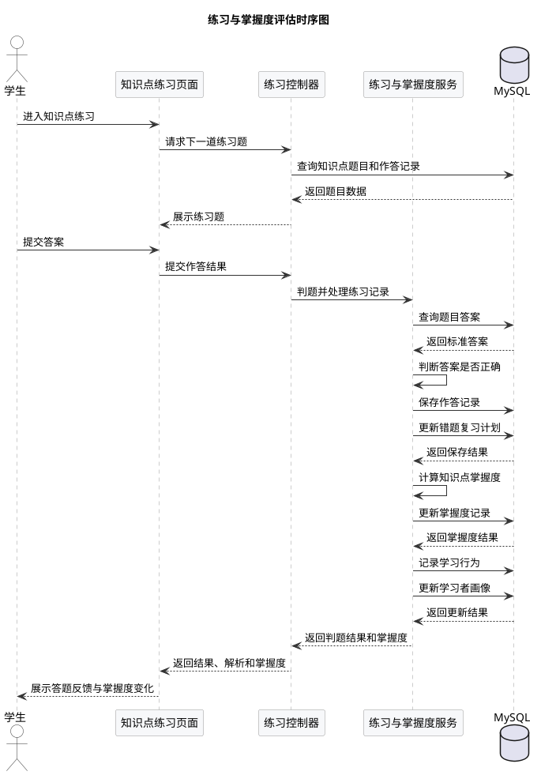

# 练习与掌握度评估时序图

```plantuml
@startuml
title 练习与掌握度评估时序图

skinparam shadowing false
skinparam sequence {
  ArrowColor #333333
  LifeLineBorderColor #999999
  ParticipantBorderColor #999999
  ParticipantBackgroundColor #F7F8FA
  ActorBorderColor #333333
  ActorBackgroundColor #FFFFFF
}

actor "学生" as Student
participant "知识点练习页面" as Page
participant "练习控制器" as Controller
participant "练习与掌握度服务" as Service
database "MySQL" as DB

Student -> Page : 进入知识点练习
Page -> Controller : 请求下一道练习题
Controller -> DB : 查询知识点题目和作答记录
DB --> Controller : 返回题目数据
Controller --> Page : 展示练习题

Student -> Page : 提交答案
Page -> Controller : 提交作答结果
Controller -> Service : 判题并处理练习记录

Service -> DB : 查询题目答案
DB --> Service : 返回标准答案
Service -> Service : 判断答案是否正确

Service -> DB : 保存作答记录
Service -> DB : 更新错题复习计划
DB --> Service : 返回保存结果

Service -> Service : 计算知识点掌握度
Service -> DB : 更新掌握度记录
DB --> Service : 返回掌握度结果

Service -> DB : 记录学习行为
Service -> DB : 更新学习者画像
DB --> Service : 返回更新结果

Service --> Controller : 返回判题结果和掌握度
Controller --> Page : 返回结果、解析和掌握度
Page --> Student : 展示答题反馈与掌握度变化

@enduml
```

