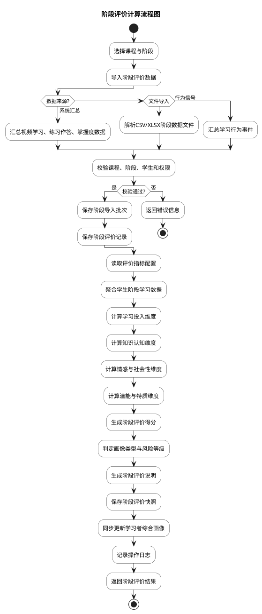

# 阶段评价计算流程图

```plantuml
@startuml
title 阶段评价计算流程图

skinparam shadowing false
skinparam activity {
  BorderColor #333333
  BackgroundColor #FFFFFF
  DiamondBorderColor #333333
  DiamondBackgroundColor #FFFFFF
}

start

:选择课程与阶段;
:导入阶段评价数据;

if (数据来源?) then (系统汇总)
  :汇总视频学习、练习作答、掌握度数据;
elseif (文件导入)
  :解析CSV/XLSX阶段数据文件;
else (行为信号)
  :汇总学习行为事件;
endif

:校验课程、阶段、学生和权限;

if (校验通过?) then (是)
  :保存阶段导入批次;
  :保存阶段评价记录;
else (否)
  :返回错误信息;
  stop
endif

:读取评价指标配置;
:聚合学生阶段学习数据;
:计算学习投入维度;
:计算知识认知维度;
:计算情感与社会性维度;
:计算潜能与特质维度;

:生成阶段评价得分;
:判定画像类型与风险等级;
:生成阶段评价说明;

:保存阶段评价快照;
:同步更新学习者综合画像;
:记录操作日志;
:返回阶段评价结果;

stop

@enduml
```

