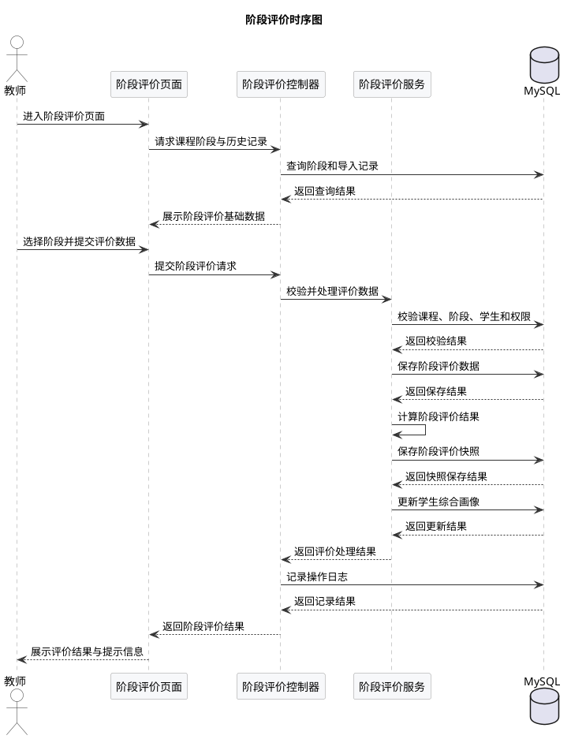

# 阶段评价时序图

```plantuml
@startuml
title 阶段评价时序图

skinparam shadowing false
skinparam sequence {
  ArrowColor #333333
  LifeLineBorderColor #999999
  ParticipantBorderColor #999999
  ParticipantBackgroundColor #F7F8FA
  ActorBorderColor #333333
  ActorBackgroundColor #FFFFFF
}

actor "教师" as Teacher
participant "阶段评价页面" as Page
participant "阶段评价控制器" as Controller
participant "阶段评价服务" as Service
database "MySQL" as DB

Teacher -> Page : 进入阶段评价页面
Page -> Controller : 请求课程阶段与历史记录
Controller -> DB : 查询阶段和导入记录
DB --> Controller : 返回查询结果
Controller --> Page : 展示阶段评价基础数据

Teacher -> Page : 选择阶段并提交评价数据
Page -> Controller : 提交阶段评价请求
Controller -> Service : 校验并处理评价数据

Service -> DB : 校验课程、阶段、学生和权限
DB --> Service : 返回校验结果

Service -> DB : 保存阶段评价数据
DB --> Service : 返回保存结果

Service -> Service : 计算阶段评价结果
Service -> DB : 保存阶段评价快照
DB --> Service : 返回快照保存结果

Service -> DB : 更新学生综合画像
DB --> Service : 返回更新结果

Service --> Controller : 返回评价处理结果
Controller -> DB : 记录操作日志
DB --> Controller : 返回记录结果

Controller --> Page : 返回阶段评价结果
Page --> Teacher : 展示评价结果与提示信息

@enduml
```

