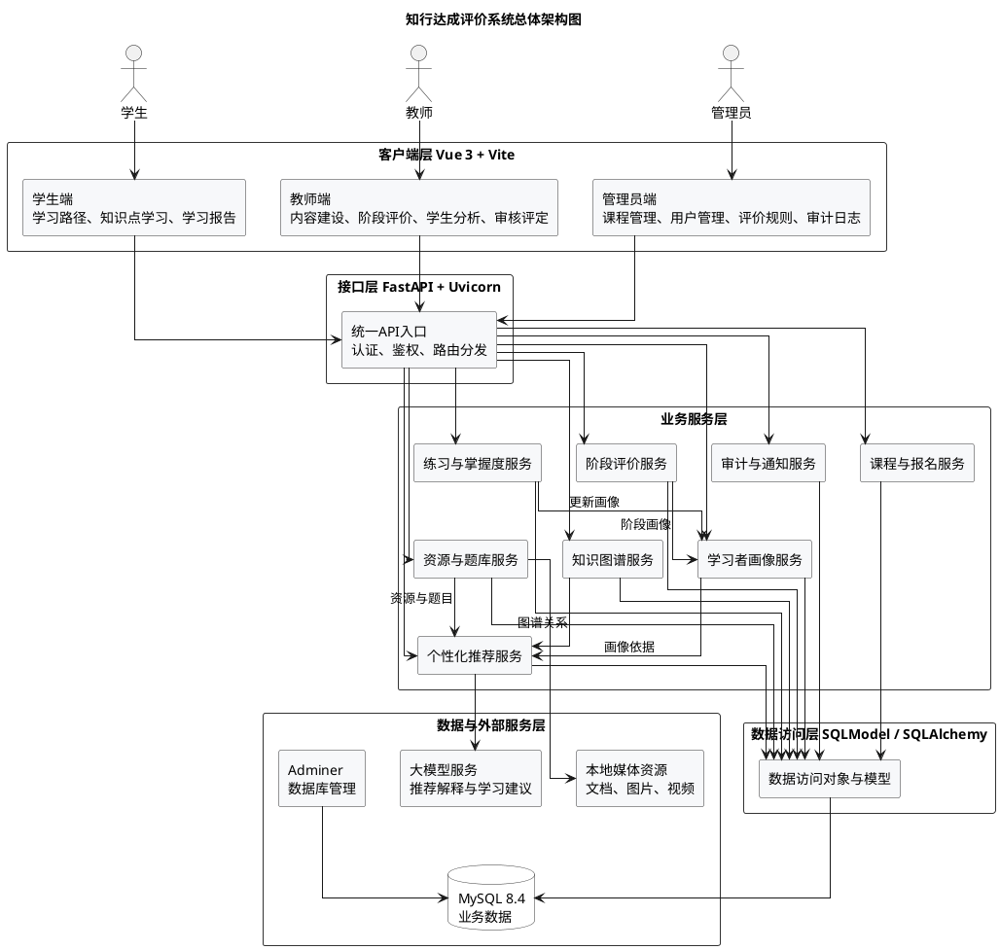

# 系统总体架构图

```plantuml
@startuml
title 知行达成评价系统总体架构图

top to bottom direction

skinparam shadowing false
skinparam componentStyle rectangle
skinparam packageStyle rectangle
skinparam linetype ortho
skinparam rectangle {
  BorderColor #333333
}
skinparam component {
  BorderColor #333333
  BackgroundColor #F7F8FA
}
skinparam database {
  BorderColor #333333
  BackgroundColor #FFFFFF
}

actor "学生" as Student
actor "教师" as Teacher
actor "管理员" as Admin

rectangle "客户端层 Vue 3 + Vite" as ClientLayer {
  component "学生端\n学习路径、知识点学习、学习报告" as StudentClient
  component "教师端\n内容建设、阶段评价、学生分析、审核评定" as TeacherClient
  component "管理员端\n课程管理、用户管理、评价规则、审计日志" as AdminClient
}

rectangle "接口层 FastAPI + Uvicorn" as ApiLayer {
  component "统一API入口\n认证、鉴权、路由分发" as ApiGateway
}

rectangle "业务服务层" as ServiceLayer {
  component "课程与报名服务" as CourseService
  component "知识图谱服务" as GraphService
  component "资源与题库服务" as ContentService
  component "练习与掌握度服务" as PracticeService
  component "阶段评价服务" as StageService
  component "学习者画像服务" as ProfileService
  component "个性化推荐服务" as RecoService
  component "审计与通知服务" as AuditService
}

rectangle "数据访问层 SQLModel / SQLAlchemy" as DataLayer {
  component "数据访问对象与模型" as Repository
}

rectangle "数据与外部服务层" as InfraLayer {
  database "MySQL 8.4\n业务数据" as MySQL
  component "本地媒体资源\n文档、图片、视频" as Media
  component "大模型服务\n推荐解释与学习建议" as LLM
  component "Adminer\n数据库管理" as Adminer
}

Student --> StudentClient
Teacher --> TeacherClient
Admin --> AdminClient

StudentClient --> ApiGateway
TeacherClient --> ApiGateway
AdminClient --> ApiGateway

ApiGateway --> CourseService
ApiGateway --> GraphService
ApiGateway --> ContentService
ApiGateway --> PracticeService
ApiGateway --> StageService
ApiGateway --> ProfileService
ApiGateway --> RecoService
ApiGateway --> AuditService

CourseService --> Repository
GraphService --> Repository
ContentService --> Repository
PracticeService --> Repository
StageService --> Repository
ProfileService --> Repository
RecoService --> Repository
AuditService --> Repository

Repository --> MySQL
ContentService --> Media
RecoService --> LLM
Adminer --> MySQL

PracticeService --> ProfileService : 更新画像
StageService --> ProfileService : 阶段画像
ProfileService --> RecoService : 画像依据
GraphService --> RecoService : 图谱关系
ContentService --> RecoService : 资源与题目

@enduml
```
