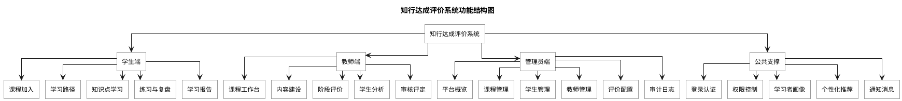

# 系统功能结构图

```plantuml
@startuml
title 知行达成评价系统功能结构图

top to bottom direction
skinparam shadowing false
skinparam linetype ortho
skinparam nodesep 12
skinparam ranksep 18
skinparam defaultFontSize 12
skinparam rectangle {
  BorderColor #333333
  BackgroundColor #FFFFFF
  RoundCorner 0
  Padding 4
}

rectangle "知行达成评价系统" as System

rectangle "学生端" as Student
rectangle "教师端" as Teacher
rectangle "管理员端" as Admin
rectangle "公共支撑" as Common

System --> Student
System --> Teacher
System --> Admin
System --> Common

rectangle "课程加入" as S1
rectangle "学习路径" as S2
rectangle "知识点学习" as S3
rectangle "练习与复盘" as S4
rectangle "学习报告" as S5

Student --> S1
Student --> S2
Student --> S3
Student --> S4
Student --> S5

rectangle "课程工作台" as T1
rectangle "内容建设" as T2
rectangle "阶段评价" as T3
rectangle "学生分析" as T4
rectangle "审核评定" as T5

Teacher --> T1
Teacher --> T2
Teacher --> T3
Teacher --> T4
Teacher --> T5

rectangle "平台概览" as A1
rectangle "课程管理" as A2
rectangle "学生管理" as A3
rectangle "教师管理" as A4
rectangle "评价配置" as A5
rectangle "审计日志" as A6

Admin --> A1
Admin --> A2
Admin --> A3
Admin --> A4
Admin --> A5
Admin --> A6

rectangle "登录认证" as C1
rectangle "权限控制" as C2
rectangle "学习者画像" as C3
rectangle "个性化推荐" as C4
rectangle "通知消息" as C5

Common --> C1
Common --> C2
Common --> C3
Common --> C4
Common --> C5

@enduml
```

