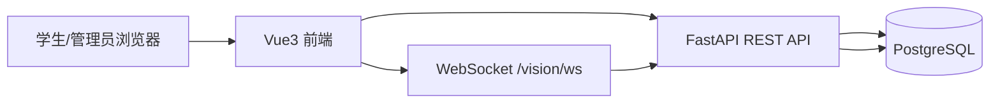

# 动态评价与自适应推荐学习系统
## 课程设计/毕业设计系统原型文档

---

## 封面信息（可按学校模板替换）
- 题目：动态评价与自适应推荐学习系统设计与实现
- 学院：__________
- 专业：__________
- 姓名：__________
- 学号：__________
- 指导教师：__________
- 日期：__________

---

## 摘要
本文面向“课程学习过程中的个性化推荐”场景，设计并实现了一个动态评价与自适应推荐学习系统。系统采用前后端分离架构，后端基于 FastAPI + SQLModel + PostgreSQL，前端基于 Vue3 + Element Plus，覆盖学习端与管理端两类用户。  
系统以课程-知识点为主线，支持学习资源观看、小测、练习、错题复习、笔记记录，并通过“规则策略 + 模型评分”的方式推荐下一题和学习路径。系统同时接入实时行为信号采集（WebSocket），为学习状态评估提供辅助信息。  
本文给出系统原型设计，包括需求分析、功能结构、页面原型、数据库设计、核心接口、验收标准及部署方案，为后续功能扩展与工程上线提供基础。

**关键词**：自适应学习；推荐系统；动态评价；知识点图谱；FastAPI；Vue3

---

## 目录
1. 项目背景与目标  
2. 需求分析  
3. 系统总体设计  
4. 功能原型设计  
5. 数据库原型设计  
6. 推荐系统原型设计  
7. 接口原型设计  
8. 测试与验收标准  
9. 部署与运维方案  
10. 风险与后续规划  

---

## 1. 项目背景与目标

### 1.1 项目背景
传统在线学习平台常采用固定题单与统一进度，难以适配学习者差异，导致“题目难度不匹配、学习效率低、反馈滞后”等问题。针对该问题，本项目构建动态评价系统，根据学习行为实时调整推荐策略。

### 1.2 建设目标
1. 建立课程-知识点-题库一体化学习平台。  
2. 实现学生学习闭环：资源学习 → 小测/练习 → 动态推荐 → 掌握度更新。  
3. 支持管理端完成课程、知识点、先修关系、题库、小测、视频等配置。  
4. 输出可解释的推荐依据与可视化学习统计。  

### 1.3 适用范围
当前版本主要面向计算机专业课程学习场景，可迁移到其他课程体系。

---

## 2. 需求分析

### 2.1 角色需求
1. 学生：查看课程与知识点、学习视频、完成小测与练习、查看掌握度与错题、记录笔记。  
2. 管理员/教师：维护课程体系、知识点图谱、题库与小测、绑定学习资源、查看报表、审计操作。  

### 2.2 功能需求
1. 账号与权限：登录注册、角色区分、权限拦截。  
2. 课程体系：课程管理、知识点管理、先修边管理。  
3. 学习资源：B站/本地/URL 视频绑定与播放进度采集。  
4. 练习系统：题目推荐、答题提交、解析反馈、错题复习。  
5. 小测系统：知识点小测配置与结果判断。  
6. 推荐系统：综合多信号给出下一题与下一知识点建议。  
7. 报表系统：练习统计、行为信号统计、管理端可视化查看。  
8. 审计系统：关键管理操作日志记录。  

### 2.3 非功能需求
1. 可用性：核心操作路径清晰，页面响应快。  
2. 可维护性：模块化分层，便于功能扩展。  
3. 安全性：JWT 鉴权、角色鉴权、配置与日志隔离。  
4. 可部署性：支持本地开发与 Docker 化数据库部署。  

---

## 3. 系统总体设计

### 3.1 架构设计
系统采用前后端分离架构：
- 前端：Vue3 + Vue Router + Element Plus  
- 后端：FastAPI + SQLModel  
- 数据库：PostgreSQL  
- 实时通道：WebSocket（行为信号采集）  

### 3.2 模块划分
1. 认证模块（auth）  
2. 学习内容模块（content/notes/resource）  
3. 练习与小测模块（practice/quiz）  
4. 推荐模块（reco/reco_policy/dl_reco）  
5. 管理模块（admin）  
6. 行为信号模块（vision_ws/vision）  
7. 评估模块（eval/mastery）  

### 3.3 技术选型说明
1. FastAPI：接口开发效率高，天然支持异步与文档化。  
2. SQLModel：与 Pydantic/SQLAlchemy 配合，开发成本低。  
3. PostgreSQL：关系模型稳定，便于统计查询。  
4. Vue3：组件化清晰，适合中后台与学习端混合场景。  

---

## 4. 功能原型设计

### 4.1 启动与登录
- 页面：`/start`、`/login`  
- 功能：系统入口展示、学生/管理员登录、登录后按角色进入对应端。  

### 4.2 学生端原型
页面：
1. ` /student/overview` 学习总览（掌握度、学习进展）  
2. ` /student/resource` 学习资源（视频学习与进度）  
3. ` /student/quiz` 小测  
4. ` /student/practice` 练习与推荐题目  
5. ` /student/notes` 笔记  

核心交互：
1. 选择课程与知识点。  
2. 查看掌握度与推荐建议。  
3. 作答后即时返回正确性与解析。  
4. 错题进入复习队列，支持重练。  

### 4.3 管理端原型
页面：
1. ` /admin/config` 评价与推荐参数配置  
2. ` /admin/video` 视频绑定（B站/本地/URL）  
3. ` /admin/questions` 题库管理与小测编排  
4. ` /admin/courses` 课程管理  
5. ` /admin/kps` 知识点管理  
6. ` /admin/edges` 先修关系管理  
7. ` /admin/users` 用户管理  
8. ` /admin/report` 练习报表  
9. ` /admin/expression` 行为信号报表  
10. ` /admin/audit` 操作日志  

### 4.4 用例原型（文本）
**学生端用例**：登录、选知识点、看视频、做小测、做练习、看解析、记笔记、查统计。  
**管理端用例**：配置参数、建课程、建知识点、建先修边、录题、配小测、看报表、查日志。  

---

## 5. 数据库原型设计

### 5.1 核心实体
1. 用户：`User`  
2. 课程：`Course`  
3. 知识点：`KnowledgePoint`  
4. 先修关系：`KnowledgeEdge`  
5. 学习资源：`LearningResource`  
6. 题目与作答：`Question`、`PracticeAttempt`  
7. 小测：`Quiz`、`QuizItem`、`QuizAttempt`  
8. 掌握度：`Mastery`  
9. 行为信号：`ExpressionEvent`  
10. 复习计划：`ReviewSchedule`  
11. 配置：`EvalConfig`  
12. 审计日志：`AuditLog`  

### 5.2 关键关系
1. 一个课程包含多个知识点。  
2. 知识点之间可形成先修有向边。  
3. 一个知识点可绑定多个题目与资源。  
4. 用户在知识点维度产生练习、小测、掌握度、行为事件记录。  

---

## 6. 推荐系统原型设计

### 6.1 输入信号
1. 练习正确率与最近作答结果。  
2. 题目难度与题型。  
3. 错题连续情况。  
4. 小测结果与掌握度。  
5. 行为信号（难度/置信度）作为辅助。  

### 6.2 推荐策略
1. 规则层：证据清单、解锁阈值、难度步进与稳定区控制。  
2. 模型层：MLP 对候选题进行概率评分（可选启用）。  
3. 融合层：规则分与模型分融合后选题。  

### 6.3 输出结果
1. 下一题推荐。  
2. 难度区间说明。  
3. 下一知识点是否可解锁。  
4. 补救建议（同难度复核/补救路径）。  

---

## 7. 接口原型设计

### 7.1 认证类
1. `POST /api/auth/login`  
2. `POST /api/auth/register`  
3. `GET /api/auth/me`  

### 7.2 学习类
1. `GET /api/graph/courses`  
2. `GET /api/graph/kps`  
3. `GET /api/content/resources`  
4. `POST /api/practice/submit`  
5. `GET /api/reco`  
6. `GET /api/eval/mastery`  

### 7.3 管理类
1. `POST /api/admin/seed`、`POST /api/admin/seed/full`  
2. `GET/PUT /api/admin/config`  
3. `GET/POST/PUT/DELETE /api/admin/courses`  
4. `GET/POST/PUT/DELETE /api/admin/kps`  
5. `GET/POST/PUT/DELETE /api/admin/questions`  
6. `GET /api/admin/practice/report`  
7. `GET /api/admin/expression/report`  
8. `GET /api/admin/audit`  

### 7.4 实时类
1. `WS /api/vision/ws?token=...`：上送图像帧，返回标签/置信度/难度。  

---

## 8. 测试与验收标准

### 8.1 功能测试
1. 登录后按角色正确跳转。  
2. 学生能完成“资源-小测-练习-掌握度更新”闭环。  
3. 管理端可完成课程到题库全配置流程。  
4. 推荐接口能稳定返回结果与依据字段。  

### 8.2 数据测试
1. 支持一键初始化 Demo 数据。  
2. 做题记录、掌握度、行为信号可正确入库。  
3. 报表统计与数据库记录一致。  

### 8.3 性能与稳定性（基础）
1. 核心接口平均响应可控（开发环境下秒级内）。  
2. WebSocket 采集过程中系统可持续运行。  

---

## 9. 部署与运维方案

### 9.1 开发环境
1. 后端：Python 3.11，`uvicorn app.main:app --reload --port 8000`  
2. 前端：`npm run dev`（5173）  
3. 数据库：Docker Compose 启动 Postgres + pgAdmin  

### 9.2 初始化流程
1. 配置 `backend/.env`（DATABASE_URL、SECRET_KEY 等）。  
2. 执行 `backend/scripts/init_system.py --reset`。  
3. 启动前后端并访问系统。  

### 9.3 运维建议
1. 生产环境使用独立随机 `SECRET_KEY`。  
2. 加入健康检查与日志轮转。  
3. 定期备份 PostgreSQL 数据。  

---

## 10. 风险与后续规划

### 10.1 当前风险
1. 推荐参数仍依赖经验配置，个体泛化能力有待验证。  
2. 行为信号在复杂场景可能存在噪声。  
3. 界面一致性与交互细节仍可继续优化。  

### 10.2 后续规划
1. 引入真实学习数据，开展离线评估（准确率/学习增益）。  
2. 迭代推荐算法与解释机制，提升稳定性与可解释性。  
3. 增强报表维度与导出能力。  
4. 推进生产级部署（网关、监控、告警）。  

---

## 附录
- 项目根目录：`Learning`  
- 后端入口：`backend/app/main.py`  
- 前端入口：`frontend/src/main.ts`  
- 路由：`frontend/src/router.ts`  
- 初始化脚本：`backend/scripts/init_system.py`  

